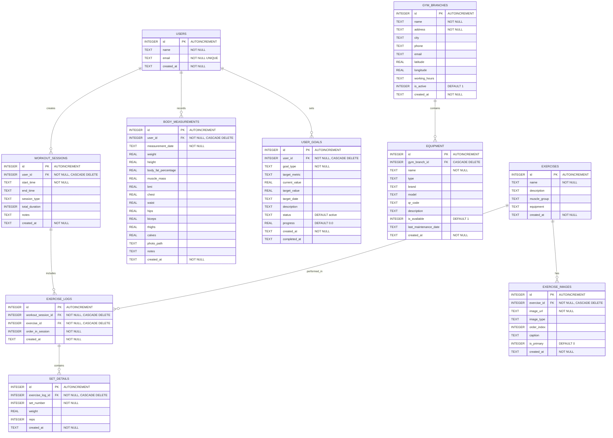

# Database Schema (Mermaid Diagram)

## Güncel Veritabanı Yapısı - 10 Tablo



## Foreign Key İlişkileri (Detaylı)

### 1. USERS → WORKOUT_SESSIONS (1:N)
```sql
FOREIGN KEY (user_id) REFERENCES users(id) ON DELETE CASCADE
```
- **İlişki**: Bir kullanıcı birden fazla antrenman seansı oluşturabilir
- **Cascade**: Kullanıcı silindiğinde tüm antrenman seansları da silinir

### 2. USERS → BODY_MEASUREMENTS (1:N)
```sql
FOREIGN KEY (user_id) REFERENCES users(id) ON DELETE CASCADE
```
- **İlişki**: Bir kullanıcı birden fazla vücut ölçümü kaydedebilir
- **Cascade**: Kullanıcı silindiğinde tüm ölçümler de silinir

### 3. USERS → USER_GOALS (1:N)
```sql
FOREIGN KEY (user_id) REFERENCES users(id) ON DELETE CASCADE
```
- **İlişki**: Bir kullanıcı birden fazla hedef belirleyebilir
- **Cascade**: Kullanıcı silindiğinde tüm hedefler de silinir

### 4. GYM_BRANCHES → EQUIPMENT (1:N)
```sql
FOREIGN KEY (gym_branch_id) REFERENCES gym_branches(id) ON DELETE CASCADE
```
- **İlişki**: Bir salon birden fazla ekipman içerebilir
- **Cascade**: Salon silindiğinde tüm ekipmanlar da silinir

### 5. WORKOUT_SESSIONS → EXERCISE_LOGS (1:N)
```sql
FOREIGN KEY (workout_session_id) REFERENCES workout_sessions(id) ON DELETE CASCADE
```
- **İlişki**: Bir antrenman seansı birden fazla egzersiz kaydı içerebilir
- **Cascade**: Seans silindiğinde tüm egzersiz kayıtları da silinir

### 6. EXERCISES → EXERCISE_LOGS (1:N)
```sql
FOREIGN KEY (exercise_id) REFERENCES exercises(id) ON DELETE CASCADE
```
- **İlişki**: Bir egzersiz birden fazla kayıtta kullanılabilir
- **Cascade**: Egzersiz silindiğinde tüm kayıtları da silinir

### 7. EXERCISE_LOGS → SET_DETAILS (1:N)
```sql
FOREIGN KEY (exercise_log_id) REFERENCES exercise_logs(id) ON DELETE CASCADE
```
- **İlişki**: Bir egzersiz kaydı birden fazla set detayı içerebilir
- **Cascade**: Egzersiz kaydı silindiğinde tüm set detayları da silinir

### 8. EXERCISES → EXERCISE_IMAGES (1:N)
```sql
FOREIGN KEY (exercise_id) REFERENCES exercises(id) ON DELETE CASCADE
```
- **İlişki**: Bir egzersiz birden fazla görsel içerebilir
- **Cascade**: Egzersiz silindiğinde tüm görselleri de silinir

## Tablo İsimlendirme Standartları

### SQL Standartları (Kullanılan)
- ✅ **Küçük harf**: `users`, `gym_branches`, `equipment`
- ✅ **Snake_case**: `workout_sessions`, `exercise_logs`, `set_details`
- ✅ **Çoğul isimler**: `users`, `exercises`, `sessions`
- ✅ **Açıklayıcı**: `body_measurements`, `user_goals`, `exercise_images`

### Neden Bu Standart?
1. **SQLite Best Practices**: Küçük harf ve underscore
2. **Flutter/Dart Convention**: Snake_case SQL için standart
3. **Cross-platform**: Büyük/küçük harf duyarlılığı problemleri yok
4. **Okunabilirlik**: `workout_sessions` > `WorkoutSessions`

## DatabaseHelper Metod İsimleri (Tablo Uyumu)

### ✅ USERS Tablosu
```dart
createUser(User user) → users
getUser(int id) → users
getAllUsers() → users
```

### ✅ EXERCISES Tablosu
```dart
createExercise(Exercise exercise) → exercises
getExercise(int id) → exercises
getAllExercises() → exercises
getExercisesByEquipment(String) → exercises
```

### ✅ WORKOUT_SESSIONS Tablosu
```dart
createWorkoutSession(WorkoutSession) → workout_sessions
getWorkoutSessionsByUser(int, int) → workout_sessions
getLastDaysActivity(int, int) → workout_sessions
```

### ✅ EXERCISE_LOGS Tablosu
```dart
createExerciseLog(ExerciseLog) → exercise_logs
getExerciseLogsBySession(int) → exercise_logs
```

### ✅ SET_DETAILS Tablosu
```dart
createSetDetails(SetDetails) → set_details
getSetDetailsByLog(int) → set_details
getLastSetDetailsForExercise(int, int) → set_details
```

### ✅ BODY_MEASUREMENTS Tablosu
```dart
createBodyMeasurement(BodyMeasurements) → body_measurements
getBodyMeasurementsByUser(int) → body_measurements
getBodyWeightHistory(int, int) → body_measurements
```

### ✅ USER_GOALS Tablosu
```dart
createUserGoal(UserGoal) → user_goals
getUserGoalsByUser(int) → user_goals
```

### ✅ EXERCISE_IMAGES Tablosu
```dart
createExerciseImage(ExerciseImage) → exercise_images
getExerciseImagesByExercise(int) → exercise_images
```

### ✅ GYM_BRANCHES Tablosu
```dart
createGymBranch(GymBranch) → gym_branches
getAllGymBranches() → gym_branches
getGymBranch(int) → gym_branches
```

### ✅ EQUIPMENT Tablosu
```dart
createEquipment(Equipment) → equipment
getEquipmentByQRCode(String) → equipment
getEquipmentByGymBranch(int) → equipment
```

## Veri İlişki Akışı

### Antrenman Kaydı Akışı
```
USER → WORKOUT_SESSION → EXERCISE_LOG → SET_DETAILS
  ↓
  1. Kullanıcı antrenman başlatır
  2. Egzersizler eklenir
  3. Her egzersiz için setler kaydedilir
```

### İlerleme Takibi Akışı
```
USER → BODY_MEASUREMENTS (photo_path ile)
  ↓
  1. Kullanıcı fotoğraf çeker
  2. Ölçümler kaydedilir
  3. İstatistikler hesaplanır
```

### Salon ve Ekipman Akışı
```
GYM_BRANCH → EQUIPMENT → EXERCISES
  ↓
  1. Salon tanımlanır
  2. Ekipmanlar eklenir (QR code ile)
  3. Egzersizler ekipmana bağlanır
```

## Cascade Delete Zinciri

### USER silindiğinde:
```
USER
 ├── WORKOUT_SESSIONS (cascade)
 │    └── EXERCISE_LOGS (cascade)
 │         └── SET_DETAILS (cascade)
 ├── BODY_MEASUREMENTS (cascade)
 └── USER_GOALS (cascade)
```

### GYM_BRANCH silindiğinde:
```
GYM_BRANCH
 └── EQUIPMENT (cascade)
```

### EXERCISE silindiğinde:
```
EXERCISE
 ├── EXERCISE_LOGS (cascade)
 │    └── SET_DETAILS (cascade)
 └── EXERCISE_IMAGES (cascade)
```

## Performans Optimizasyonları

### İndeksler (Önerilen)
```sql
CREATE INDEX idx_workout_sessions_user_id ON workout_sessions(user_id);
CREATE INDEX idx_workout_sessions_start_time ON workout_sessions(start_time);
CREATE INDEX idx_exercise_logs_workout_session_id ON exercise_logs(workout_session_id);
CREATE INDEX idx_set_details_exercise_log_id ON set_details(exercise_log_id);
CREATE INDEX idx_body_measurements_user_id ON body_measurements(user_id);
CREATE INDEX idx_equipment_qr_code ON equipment(qr_code);
```

### Query Optimizasyonları
1. **JOIN'lerde foreign key kullanımı**: Tüm JOIN'ler foreign key üzerinden
2. **WHERE clause'larda indeksli kolonlar**: `user_id`, `start_time` vb.
3. **LIMIT kullanımı**: Büyük sonuçlarda sayfa sayfa yükleme

## Veri Tutarlılığı Kuralları

1. **NOT NULL Constraints**: Zorunlu alanlar belirtilmiş
2. **UNIQUE Constraints**: `users.email` benzersiz olmalı
3. **DEFAULT Values**: `is_active`, `is_primary`, `progress` için varsayılanlar
4. **CASCADE DELETE**: Veri bütünlüğü korunuyor
5. **Foreign Key Validation**: SQLite foreign key desteği aktif

## Migration Geçmişi

- **v1**: İlk 10 tablo oluşturuldu
- **v2**: `gym_branches` tablosuna `qr_code` eklendi
- **v3**: `equipment` tablosuna detaylı alanlar eklendi
- **v4**: `body_measurements` tablosuna `photo_path` eklendi

## Kullanım Örnekleri

### Antrenman Seansı Oluşturma
```dart
final session = WorkoutSession(
  userId: 1,
  startTime: DateTime.now(),
);
final savedSession = await db.createWorkoutSession(session);
```

### Set Detayları Kaydetme
```dart
final setDetail = SetDetails(
  exerciseLogId: logId,
  setNumber: 1,
  weight: 80.0,
  reps: 10,
);
await db.createSetDetails(setDetail);
```

### Vücut Ölçümü Kaydetme
```dart
final measurement = BodyMeasurements(
  userId: 1,
  measurementDate: DateTime.now(),
  weight: 75.5,
  photoPath: '/path/to/photo.jpg',
);
await db.createBodyMeasurement(measurement);
```

## Sonuç

✅ **10 Tablo**: Tüm tablolar tanımlandı  
✅ **8 Foreign Key**: Tüm ilişkiler doğru kuruldu  
✅ **CASCADE DELETE**: Veri bütünlüğü sağlandı  
✅ **SQL Standartları**: İsimlendirme kurallarına uyuldu  
✅ **Metod Uyumu**: DatabaseHelper metodları tablo isimleriyle uyumlu  
✅ **Mermaid Diyagram**: Güncel ve detaylı
